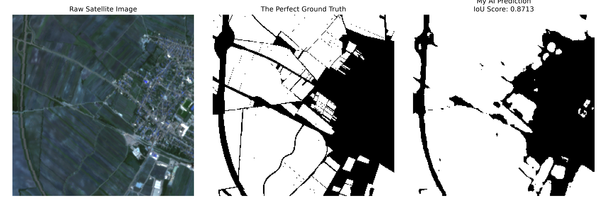
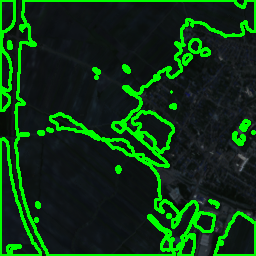

# Agri-Boundary AI: Multi-Spectral Field Extractor

## What You Are Looking At (The Visual Breakdown)
I hate repositories that throw thousands of lines of code at you without showing you what the software actually produces. The image at the top of this document is the final verification report generated by my evaluation script. I set it up as a three-panel comparison so anyone can inspect how my network interprets the earth from orbit.

**The Raw Satellite View (Left Panel):** This is a 10-meter resolution patch taken directly by the European Space Agency's Sentinel-2 satellite constellation. When you first download raw satellite tiles, they look like pitch-black squares on a standard computer monitor. That isn't a file error. Standard computer monitors render 8-bit color channels with values ranging from 0 to 255. Scientific satellite sensors, on the other hand, record surface reflectance values on a massive 16-bit radiometric scale ranging from 0 to 10,000. They need that massive dynamic range so they don't blow out the sensors when photographing blinding white glaciers or thick ocean storm clouds. Because normal dirt and agricultural crops only reflect a small fraction of sunlight, compressing that raw array straight down to an 8-bit monitor makes the fields look like the middle of the night. I wrote custom scaling math in my plotting script that applies a 3.5x multiplier to the top three visible bands. That brings the farm back into bright daylight so human eyes can see the roads, hedgerows, and crop rows.

**The Ground Truth Mask (Middle Panel):** This is the answer key. These outlines were derived from official European Land Parcel Identification System (LPIS) registries, which are the cadastral records farmers submit to regional governments to claim agricultural subsidies. The white regions represent legally declared agricultural parcels. The black regions are tractor access roads, irrigation ditches, forest patches, and property boundaries.

**My Network's Prediction (Right Panel):** This is what my neural network drew after chewing through the six-band multi-spectral array. The network outputs a continuous probability map where every single pixel is scored between 0.0 (definitely not a field) and 1.0 (definitely a field). By thresholding that probability surface at 0.5, I produce a clean binary mask. Notice how sharply the AI carves out the access roads between the plots. It didn't just blob everything together into a green mess; it actually identified the distinct edges where one field stops and the neighboring boundary begins.

A raw binary mask sitting in a NumPy array is useless to a farmer sitting in a tractor cab or a GIS analyst working in QGIS. To bridge the gap between machine learning math and real-world tools, I wrote an inference pipeline using OpenCV. The image above shows the output of that pipeline. The script takes the binary prediction array, runs border-tracing algorithms across the pixel topology, extracts the continuous geometric contours of every field, and renders them as bright green vector lines over the original satellite tile. 

## Why I Built This (The Real AgTech Problem)
I got tired of building toy projects. If you look at most computer vision portfolios online, they are identical clones of the same three beginner tutorials: classifying handwritten digits from MNIST, sorting pictures of cats and dogs, or running a pre-trained YOLO model on stock webcam video. None of those projects teach you what it feels like to work with messy, broken, real-world data.

I wanted to solve a problem that actually costs industries millions of dollars every single year.

In modern agriculture and environmental monitoring, knowing the exact boundaries of every field is mandatory. Governments use these boundaries to calculate farm subsidies, insurance companies use them to assess flood and hail damage, and agricultural tech companies use them to guide autonomous tractors. 

Right now, an unbelievable amount of that mapping is still done manually. Human cartographers sit at desks with dual monitors, zooming in on aerial maps and clicking the corners of thousands of fields by hand to trace polygon lines. It is mind-numbing work. It takes weeks, it costs fortunes, and humans get sloppy when they stare at dirt plots for eight hours straight. I set out to build an end-to-end Python pipeline that takes raw, multi-spectral satellite imagery directly from space, parses the hidden light bands that human eyes cannot see, and extracts those field parcels automatically.

## The Dataset: AI4Boundaries (70GB of Chaos)
To train an AI to find field borders, you can't just pull random satellite pictures off Google Maps. Google Maps gives you compressed RGB screenshots that have been color-corrected, sharpened, and stripped of all scientific metadata. I needed raw sensor data paired with survey-grade land parcel borders.

I landed on the AI4Boundaries dataset on Kaggle. It's an open-access benchmark dataset curated specifically for training deep learning models on agricultural delineation across Europe. 

When you extract the archive, it takes up nearly 70 Gigabytes of disk space. That massive footprint is because the dataset actually contains two completely different data products bundled together. First, the Orthophoto Archive contains high-resolution aerial photos taken by airplanes. Second, the Sentinel-2 Archive contains 10-meter multi-spectral satellite images.

I deliberately chose to ignore the aerial photos entirely. Visible light is only a tiny sliver of the electromagnetic spectrum. To a normal RGB camera, two adjacent fields might look identical because both crops are green. But plants interact with invisible light in very dramatic ways. Healthy green vegetation absorbs blue and red light for photosynthesis, but its internal leaf structure reflects almost all Near-Infrared (NIR) light to keep the plant from overheating in the sun. If a field has bare soil, dying weeds, or a gravel road running alongside it, the infrared reflection changes instantly. By relying on the multi-spectral Sentinel-2 data, I gave my neural network the ability to detect biological boundaries that are practically invisible to human eyes.

## The 6 Bands We Feed into the Network
Most vision models only accept three channels: Red, Green, and Blue. If you feed standard three-channel imagery into this task, the model struggles on hazy days or when two neighboring farms are growing the exact same crop. My network digests six continuous spectral layers stacked into a single mathematical tensor:

* Band 2 (Blue): Helpful for cutting through atmospheric haze.
* Band 3 (Green): Captures the primary green reflection peak of healthy plant canopies.
* Band 4 (Red): The primary chlorophyll absorption band. Crops absorb heavily here, while bare dirt trails reflect red light strongly.
* Band 8 (Near-Infrared): The single most important agricultural band. The cellular structure of living plant leaves scatters NIR light like a mirror. A sharp drop in NIR marks the exact perimeter where vegetation ends.
* Band 11 (Short-Wave Infrared 1): Sensitive to the water content inside plant leaves and topsoil moisture.
* Band 12 (Short-Wave Infrared 2): Differentiates between wet dirt, dry gravel roads, and dense forest canopies.

## How the AI Architecture Works (The 6-Band U-Net)
You can't use standard object detection models like YOLO for this problem. Object detectors draw rectangular bounding boxes around things. Real agricultural fields are irregular polygons with weird curves and jagged fence lines. Bounding boxes are totally useless here.

I needed semantic segmentation, which classifies every single pixel in the image independently. I built a custom U-Net architecture from scratch in PyTorch. The network works in two distinct halves. The contracting path on the left side shrinks the satellite image down through repeated convolutional blocks and max pooling. This forces the network to ignore tiny pixel noise and learn high-level contextual understanding (e.g., "This entire quadrant is a farming zone"). 

But shrinking the image destroys fine spatial detail. To fix this, the expanding path on the right side steps the spatial resolution back up. The secret sauce is the horizontal skip connections. As the network up-samples the image, it grabs the high-resolution feature maps from the left side and slaps them together. This allows the model to combine deep context with razor-sharp spatial edges, drawing crisp boundary lines instead of blurry green blobs. I had to hack the very first input layer so it could digest 6 separate channels of light instead of a standard 3-channel picture.

## The Technical Nightmare: Everything That Broke
Building this pipeline wasn't a clean, straightforward afternoon of coding. Geospatial data is notorious for breaking standard deep learning setups. I ran into four major technical roadblocks, and I had to engineer custom solutions for every single one.

**1. The 4D NetCDF Memory Crash**
When you download the Kaggle dataset, the satellite files are stored as NetCDF files. These are four-dimensional arrays tracking the exact same farm over six months of time. When my data loader tried to pull several 4D arrays into RAM simultaneously, my laptop crashed instantly. I implemented a remote sensing technique called Temporal Median Compositing. I used the xarray library to compute the statistical median along the time axis. This collapsed the six-month stack down into a single 2D grid per band, saving my GPU memory and automatically deleting passing clouds from the image.

**2. The Hidden 6-Band Discovery**
My original code assumed the NetCDF files contained five channels. During my very first training run, the script crashed with a PyTorch runtime error expecting 5 channels but receiving 6. I inspected the metadata keys and realized the dataset included both Short-Wave Infrared bands. Instead of slicing off the extra channel and throwing it away, I rewrote the front end of my neural network to process all 6 bands of light simultaneously.

**3. The 4-Channel RGBA Ground Truth Bug**
Once the six-band input was working, training restarted and crashed instantly with a binary cross-entropy error. My U-Net was outputting a 1-channel prediction, but the target masks loaded from Kaggle had four channels. The `.tif` files had been saved as 4-channel RGBA images containing redundant color channels and an alpha transparency layer. I wrote a custom shape-checking gate directly inside the Python data loader. If the mask loads with extra channels, the code automatically strips away the junk data and flattens it.

**4. The LZW Compression Wall**
While running the updated data loader, Python suddenly threw an LZW compression error. To save storage space on Kaggle servers, the authors compressed the GeoTIFF masks using LZW lossless compression, which standard Python cannot read. I resolved this by using a specific C-based decoding library called imagecodecs, which acts as a background translator and unzips the files on the fly during training.

## Hardware Reality: Training on a 6GB RTX 4050
I didn't train this model on a massive corporate cloud cluster. I developed and trained this entire pipeline locally on an MSI Prestige 14 laptop with an NVIDIA RTX 4050. It's a fast card, but it is strictly capped at 6GB of VRAM. When you are training a deep neural network on six-band satellite arrays, 6GB of memory disappears in seconds. 

To survive the memory limits, I implemented PyTorch's GradScaler. I wrapped the forward pass inside an autocast wrapper, forcing the GPU to downcast the mathematical operations to 16-bit half-precision floats. That single change literally cut my memory footprint in half. I also built a data prep script to randomly isolate just 1,500 images for training. Training on the entire archive would have tied up my laptop for weeks, but the curated subset allowed the model to train cleanly in just a few hours.

## Codebase Architecture
* check_env.py: Verifies CUDA availability, drivers, and packages.
* data_prep.py: Scans Kaggle archive, matches .nc to .tif, builds curated subset.
* model.py: PyTorch definition of the custom 6-Band U-Net.
* train.py: Main training loop with Mixed Precision and dynamic IoU checkpointing.
* inference.py: Loads best.pt, runs inference on raw .nc tile, outputs green polygon map.
* evaluate.py: Calculates dataset IoU, corrects brightness, outputs performance chart.

## How to Run My Code
If you want to spin this up on your own machine, follow these exact steps in order.

**Step 1: Install dependencies**
Open your terminal inside the project folder and type: pip install -r requirements.txt

**Step 2: Check your hardware**
Make sure your Nvidia card is actually responding by typing: python check_env.py

**Step 3: Dataset setup**
Download AI4Boundaries from Kaggle and extract it. Create a folder named datasets inside your project folder, and inside that, create a folder named ai4boundaries. Drop the Kaggle train, val, and masks folders directly inside of it.

**Step 4: Extract the subset**
Run this so your computer doesn't crash on the 70GB dump: python data_prep.py

**Step 5: Train it**
This kicks off the training loop and saves a best.pt file if it actually improves. Type: python train.py

**Step 6: Map the polygons**
Run the AI on a fresh image to draw the green boundaries: python inference.py

**Step 7: Grade it**
Score the model, fix the brightness glitch, and output the graph: python evaluate.py

